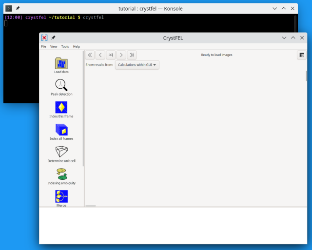
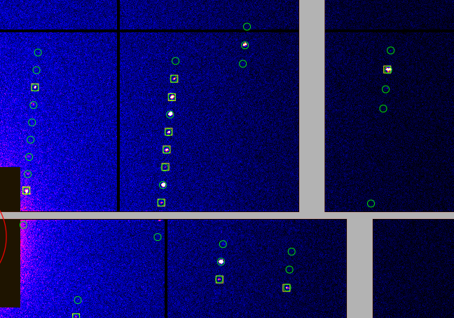
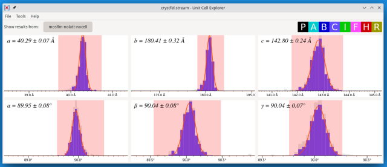
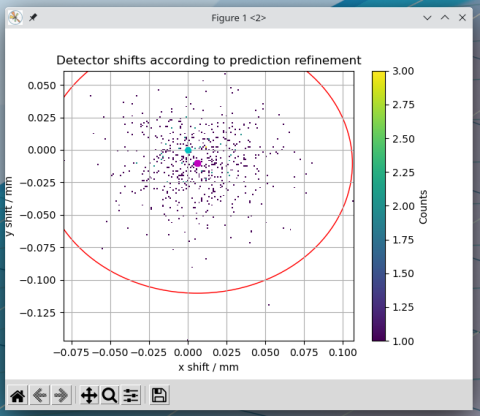
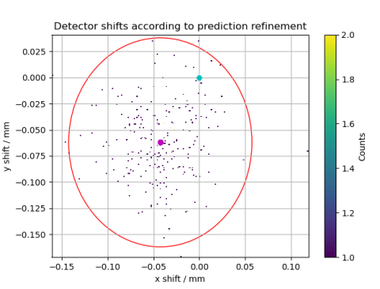
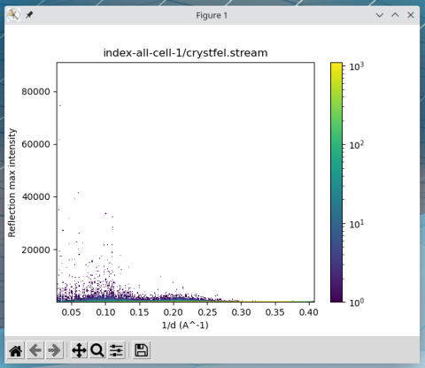
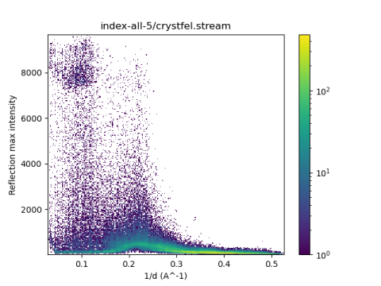

=================
CrystFEL tutorial
=================

This tutorial introduces serial crystallography data processing using the
CrystFEL graphical user interface (GUI).  It covers the main steps of using
CrystFEL based on some freely available data. The aim of this page is to equip
you with the knowledge you need to get started with processing a serial
crystallography data set on your own.

The estimated time required to complete this tutorial is about three hours,
provided that CrystFEL is already `installed <../../INSTALL.md>`_ and the data
set has already been downloaded and unpacked (downloading and unpacking is
described in step 1).  The tutorial assumes that Mosflm is available for
indexing - see the installation instructions for details. There will be several
waiting periods while data gets processed, during which you will be able to do
something else.

It's also possible to run CrystFEL almost entirely via the command line, which
gives you extra abilities compared to the GUI.  The "advanced" sections in this
tutorial will show you how this works. It's fine to skip these sections on your
first pass through.

In addition to this text document, there is also a `video screencast
<https://vimeo.com/585412404>`_ which introduces the CrystFEL graphical user
interface.  The video is aimed at people who already have some experience with
CrystFEL, but should be useful for everyone.

Let's get started!

1. Download some data
=====================

Start by creating an empty directory to work in.  You'll start by downloading a
few data files into your working directory.  The files are large (38 Gb for the
file suggested below), so make sure you have enough disk space available.

There are many serial crystallography datasets available from the `Coherent X-ray
Imaging Data Bank <https://cxidb.org/>`_.  For this tutorial, we'll use
`dataset 103 <https://cxidb.org/id-103.html>`_.  This datasaet is from an
experiment that was performed at the `Alvra experimental station
<https://www.psi.ch/de/alvra>`_ at `SwissFEL <https://www.psi.ch/en/swissfel>`_.

You can download as much data as you have disk space for, but one file is
enough to demonstrate the principles. Here, we will use file
`run7.JF06T32V01.h5
<http://portal.nersc.gov/archive/home/projects/cxidb/www/103/Raw_Files/2018-08-10/a2a/run7.JF06T32V01.h5>`_.
Note also that the download can take some time to complete, even if you have
a fast internet connection.

In addition to the data file, you'll need a *geometry file* which tells
CrystFEL how to interpret the data file.  The geometry file contains information
about how the detector is laid out physically, as well as how the data is laid
out in the file - whether there's one frame or many frames per file, where to
find the photon energy/X-ray wavelength, and so on.  The depositors of *dataset
103* have kindly deposited a geometry file which matches their data, which you
can find on the main page for the dataset. The file is called ``jf-16M.geom``.
However, the specification for geometry files changes quite often as we add new
features to CrystFEL and deprecate others.  The geometry file on the website
will still work fine, but we provide here an updated file which will work
slightly more smoothly.  If you've downloaded CrystFEL, you'll find it in
`doc/examples/jf-swissfel-16M.geom <https://gitlab.desy.de/thomas.white/crystfel/-/raw/master/doc/examples/jf-swissfel-16M.geom?inline=false>`_.
Otherwise, click the link to download a copy, and save it in your working
directory.

Finally, you'll need a *bad pixel map* which contains the information about
which pixels of the detector cannot be trusted.  This file is also available
from the CXIDB.  Download it here -
`run47.JF06T32V01.mask.h5 <https://cxidb.org/data/103/run47.JF06T32V01.mask.h5>`_
- and save it in your working directory, alongside the geometry and data files.

Advanced
--------

If you're interested in the differences between the deposited geometry file and
the file provided here, they are as follows:

* The region masking the direct beam has been translated from lab-space
  coordinates into detector-relative coordinates, because this makes the data
  `load faster <speed.rst>`_.

* The filename for the bad pixel mask was changed to match the deposited file,
  and changed from an absolute path to a relative one.

* Units were added to the camera length and photon energy directives.

* Commented-out directives and non-useful rigid groups were removed.

2. Start the CrystFEL GUI and load the data
===========================================

Provided that CrystFEL has been installed properly, you can start the graphical
user interface (GUI) by running the command ``crystfel`` at a command line.
Make sure that you do this from the working directory, for example::

    $ cd my-working-directory
    $ crystfel

An empty workspace should open, which looks like the picture below.  If not,
see `INSTALL.md <../../INSTALL.md>`_ for details, or ask your facility or lab's
computing team.

The bar at the left (note that it may have a vertical scrollbar) shows the main
data processing steps in roughly chronological order from top to bottom.  The
white area at the bottom is the *log area*, where messages will be displayed.
The large grey area is where images will be displayed.

Start by loading the data.  To do this, click **Load data** at the top.  You
have several options for selecting your files.  In this case, we have a single
file containing the entire data of interest (``run7.JF06T32V01.h5``), so choose
the first option, *Select an individual file*.  Click the file selector button
immediately to the right and select the file in the file selection window.

You have to select the geometry file at the same time as loading the data.
Click the file selector button labelled *Geometry file* and choose the correct
file (``jf-swissfel-16M.geom``).

**Tip:** If you have a long pathname to the data, you don't have to navigate
using the buttons.  You can type or paste directly into the file selector
window: simply paste as normal (e.g. Ctrl+V), or start typing with ``/``.
This works for all file selector windows in CrystFEL.  In fact, this works for
all file selector windows in all programs using the GTK toolkit.

If everything goes well, you will see the first frame of data in the GUI.  If
not, check for error messages in the log area or on the terminal from which you
started the GUI.

When you close the main GUI window, it will offer to save the session.  You can
save your session manually at any time from the **File** menu.  Your session
will be restored the next time you start the GUI in the same folder.  All the
details are stored in a file named ``crystfel.project`` in your working
directory.  You can make a copy of this file at any time, for example for keep
a backup of your processing parameters.  You can also delete it, which will
cause the GUI to reset to an empty workspace.

3. Examine the patterns
=======================

You can navigate through the images in a familiar way.  Click and drag to move
around the frame, and use the mouse scroll wheel to zoom.  If you zoom in very
far, you will see the individual pixel values.  Using the arrow buttons near
the top of the GUI window, you can move forwards, backwards or randomly through
the images making up the dataset.

**Tip:** Shift-clicking on the "shuffle" button will move backwards through the
random order, which is often useful when you "overshoot" while looking for an
interesting pattern!

Flick through a few images and check that everything makes sense:

* Does the background scattering have circular symmetry?  If there are
  discontinuities, the geometry file might not be an accurate description of
  the experiment.  This will cause difficulties in the later steps.

* Are there any obviously bad regions of the detector, for example regions with
  all zero pixel values, or extremely high values?  For the SwissFEL example
  data, this is the case for an entire detector panel at the bottom-middle of
  the frame, as well as a for many horizontal and vertical lines criss-crossing
  each of the detector panels.  These pixels have been masked out in the
  geometry file (see
  `man crystfel_geometry <https://www.desy.de/~twhite/crystfel/manual-crystfel_geometry.html>`_
  for details), and therefore show up in a dark brown colour.  If you zoom in
  closely, you will see that the pixel values are be in parentheses.

* Can you see Bragg spots in at least some of the frames?  If there are no
  spots whatsoever, crystallographic data processing will of course fail.

4. Configure peak detection
===========================

Crystallographic data processing relies on Bragg peaks, so the first and most
important data processing step is to identify spots (peaks) in the diffraction
patterns.  Click the next icon in the toolbar, **Peak detection**, to start the
process by opening the peak detection parameters window.

There is a choice of peak detection methods available in CrystFEL, which you
can choose between using the menu button at the top.  You can easily experiment
with different methods and parameters to see what gives the best result for
your data.  The **Zaefferer gradient search (zaef)** is the fastest and
simplest to configure (fewest parameters), but doesn't work well if the
background varies a lot across the image.  The **Radial background estimation
(peakfinder8)** is the most commonly used method, but it has quite a large
number of parameters.

**Use the peak lists in the data files (hdf5/cxi)** is only used when
the data files contain peak list information.  This isn't the case for the
SwissFEL example data, but is generally quite common because the process of
"hit finding" (separating blank frames from those containing real crystal
diffraction) itself begins by finding peaks.  The peak search results from the
hit-finding step can be used for CrystFEL's processing as well, so it would be
a waste of time to do a new peak search!  Note that processing steps like peak
detection, which involve looking at every single pixel of the data, can become
quite slow when the images are very large, which is the case here (16
megapixels).

The peak search results will be marked on the image with yellow squares, and
the results will update "live" as you change the parameters (the new value
takes effect once you press Enter or move the cursor to a different parameter).
Adjust each parameter in turn and see how it affects the results.  The accuracy
of the peak search is one of the most critical factors in the success of the
indexing process, so don't rush this step.  Here are some tips for finding the
right parameters:

Threshold
   Set this by zooming in closely to the image and looking at the general
   background level compared to the level of real peaks, in a region where the
   background is quite strong.  Set the threshold about halfway between the
   two.

Minimum signal/noise ratio
   Usually this should be a single-digit number.  Start with 5, and reduce in
   steps of 1 if peaks are not being found.  Increase in steps of 1 if too many
   peaks are found.  If you find that you need a wildly different value, the
   detector parameters might not be set correctly in the geometry file
   (specifically ``adu_per_eV`` or ``adu_per_photon``), throwing off the
   statistical analysis.

Minimum number of pixels
   Usually 2 or 3 is the right value.  Decrease to 1 if the peaks are very
   sharp indeed and really do only consist of one pixel.  Increase beyond 3 if
   the peaks are broad.

Maximum number of pixels
   The peak detection should not be very sensitive to this parameter, unless
   something is wrong with the data.  Set it to around 20.

Local background radius
   Usually 3 is correct, but increase in steps of 1 if too many peaks are
   being found and the background is very inconsistent from pixel to pixel.

Minimum/maximum resolution
   Use these to restrict the peak search to an annular region in the image.
   If there is a lot of noise near the centre of the image, use the minimum
   resolution to ignore that area.  If there is a lot of noise further out in
   the frames, use the maximum resolution to cut that out.  But beware: this
   will affect CrystFEL's estimates of the maximum resolution of each
   diffraction pattern.

Half pixel shift
   This toggle is necessary because different programs use different
   conventions about coordinates.  Some (including CrystFEL) consider the
   coordinates *x,y* to refer to the point at distance *x,y* from the corner of
   the detector panel, measured in units of the width of a pixel.
   Other programs (including Cheetah) consider the coordinates *x,y* to refer
   to the centre of the *x*-th, *y*-th pixel in the two directions.  This option
   compensates for the resulting discrepancy of half a pixel width in each
   dimension.  If you're taking peak search data from the image files, try both
   options.  With one of them, the marked peak locations will be visibly far
   away from the real positions of the Bragg peaks.

Be sure to check the peak search results on more than one frame.  Jump between
frames at random to get a sampling of the entire dataset, because certain
factors can vary with time throughout the dataset (strength of background,
X-ray intensity and scattering strength of the crystals).  Make sure that peaks
are being found across the entire image, not just in one area, but remember
that it's unlikely that a "real" crystal sample diffracts X-rays right to the
corner of the detector.

A final piece of advice.  It's important not to miss too many real peaks, but
it's also possible to "over-pick" the image, finding too many weak peaks.  It's
better to find fewer peaks, but to be more confident that those peaks are
really "real", and close to the exact Bragg condition. Therefore, don't spend
too long trying to refine the parameters to pick out every single
near-invisible peak.  It depends on the data collection parameters, but the
peaks should form a geometrical pattern --- a fact which you can use to your
advantage to know which peaks are real.

**Spoiler:** the original paper corresponding to this dataset (read
`here <https://journals.iucr.org/m/issues/2020/06/00/zf5013/index.html>`_)
used *peakfinder8* with *threshold=50* and *minimum signal/noise ratio=5*.
They don't say what values they used for the other parameters, suggesting that
they used the default values: *minimum number of pixels=2*, *maximum number of
pixels=200* (unimportant), *local background radius=3*, and the *minimum/maximum
resolution* set to 0 and 2000 respectively.

Once you're happy with the results, press **Confirm**.  You can also press
**Discard changes** at any point if you mess up.

5. Index one frame
==================

We are now going to try to index the frames, which means determining the
crystal orientation and lattice parameters for each diffraction pattern.
Before trying to process the entire dataset, it's advisable to check that things
are working well for just a handful of frames.  The peak detection has already
been optimised in the previous step, but indexing frames depends on many other
factors as well.

Click **Index this frame** to open the indexing dialogue box.  For a first
attempt, leave all the parameters in the *Integration* and *Advanced Indexing*
untouched, and concentrate on *Indexing*.  The Unit cell file should say
*"(None)"* (if it doesn't, click the 'Delete' button right next to it).  Leave
*Automatically choose the indexing methods* ticked, but un-tick *Attempt to
find multiple lattices per frame* and *Retry indexing if unsuccessful*.  This
will make things slightly faster.  The *Unit cell tolerances* are unimportant
for now, as is the option *Check indexing solutions against reference cell*.
Then click **Run**.

The GUI will become unresponsive for a short while (be patient!).  When it
returns, one of two things will happen.  The first possibility is that nothing
looks any different, which indicates that the pattern could not be indexed.  In
this case, try again with other frames.  If nothing at all can be indexed, then
something is wrong.  This should obviously not be the case for this tutorial!

If the pattern can be indexed, you'll see the lattice parameters displayed in
the log area of the GUI, and the diffraction pattern itself will be covered
with green circles.  These show where Bragg spots are expected to appear, based
on the lattice parameters and crystal orientation calculated by the indexing
algorithm.  CrystFEL already does some checks to weed out bad indexing
solutions, but you'll still have to examine the results to see if they make
sense.  This is something of an art form, but the main point is to see if the
general patterns of reflections match up.  For example, the following picture
shows good alignment:

Notice that the green circles ("predicted" reflections), yellow boxes (peak
search results) and the real peaks (as seen by eye) all form lines closely
spaced in an approximately vertical direction, with much wider spacing in
the horizontal direction.  Although not all of the markers agree along each of
the lines, they all agree on the spacing and direction.  There are no "alien"
reflections in the gaps between the real reflections, in either direction.
Note also that there are some weaker peaks, not found by the peak search ,
which nevertheless agree with the indexing results.  One or two reflections
seem to be slightly misplaced, which is not a severe problem.  In this case, it
might be because the bandwidth (range of X-ray wavelengths) of the X-ray source
was quite large, which is not fully taken into account by the calculation.
You can also see that the reflections in the right-hand side of the picture
(everything except the two rows furthest to the left) form a kind of ring,
another pattern which is reproduced by the predictions, peak search results
and real peaks.

Bad signs are when both the peaks and indexing results both form lines, but
those lines are in different directions.  Another bad sign is if the patterns
seem to match up very well on one side of the pattern, but very badly on the
opposite side.

If the diffraction pattern does not have clear patterns like the example above,
it gets much harder to judge whether the indexing is correct or not.  Therefore
it's best to look for "pretty" patterns (or, at least, "pretty" regions of
patterns) to judge the correctness of indexing.

If you want to find the exact frame used for this example, it's the fourth
frame from the beginning of the dataset, assuming you downloaded the single
file suggested in step 1.

**Tip:** The indexing options will be stored, so to index another pattern you
can simply click *Index this frame* and hit the enter key.

6. Index all the frames
=======================

Now that things are working for a few test frames, it's time to expand the
processing to *every* frame in the dataset.

Click **Index all frames** in the toolbar.  The process is very similar to
indexing one frame.  In fact, the indexing parameters will be brought forward
from the *Index this frame* dialogue box into this one.  There are couple of
extra fields to fill in, though.  First of all, you need to give a name for the
job, which will be used for referring to the results.  Type something
meaningful for yourself in the box at the top, such as *index-all-nocell-1*.
Check that the other indexing parameters are how you want them, then go to
**Cluster/batch system**.  Here you can control how the job is run.  The data
processing proper will take quite a long time and use a lot of CPU power, so
if you have access to a cluster system then you should make use of it here.

There are two options found in the **Batch system** menu.  **SLURM** will make
the GUI submit its jobs through the `SLURM <https://slurm.schedmd.com/>`_
system.  You'll have to give details such as the partition name and any
relevant constraints - ask your system manager about these.  Obviously,
SLURM must be available on your system to use this option.  If in doubt, ask
your facility or lab's computing team.

If SLURM isn't available, you'll have to run "locally", which means to run on
the same computer as where the GUI itself is running.  This is the right option
if you're processing data on your own private computer, but it will probably
cause trouble if you're using a shared computer.  Therefore it's wise to make
sure you know how your system is set up!  For local processing, you only need
to give the number of threads, which as a rule should be the same as the number
of CPUs available.

Back in the indexing parameters tab, it's a good idea to set a non-zero value
for *Skip frames with fewer than ... peaks*.  This will make things faster by
skipping over frames that don't seem to have a plausible number of peaks to
constitute a real diffraction pattern.  Try setting a value of 15 here.

For a reason that will become clear later, we'll run the indexing job using
only Mosflm as the indexing engine.  So, un-tick *Automatically choose the
indexing methods*, expand the section *Select indexing methods and prior
information* and make sure that only *MOSFLM* is selected.  The checkboxes
under *Prior unit cell* and *Prior lattice type* are irrelevant for now,
because there is no prior information to use.

Finally, in the **Notes** tab you will find a free-form text entry area.  This
is for you to use for your own notes.  As the text says, anything you write
here will be stored with the results of the job you're about to start.

Once you're happy with everything, click **Run**.  You should see a progress
bar appear in the main GUI window.  You can cancel the job at any time,
obviously, by clicking the **Cancel** button.  Otherwise, now is a great time
to step away from your computer for a few minutes and make a cup of tea!
When the job has finished, the progress bar will show 100% and the *Cancel*
button will become a close button with a cross icon, which when pressed will
permanently remove the progress bar.

Advanced: Job directory contents
--------------------------------

The CrystFEL GUI places all the files related to your job into a subdirectory
of your working directory.  The subdirectory has whatever name you gave for the
job (in this case ``index-all-nocell-1``), and you are free to inspect the
contents.  The exact contents depend on which 'backend' you used (*local* or
*SLURM*) as well as the type of job (indexing, merging or ambiguity resolution,
the latter two of which will be discussed later).  Here they are for an
indexing job with the *local* system::

   [16:31] tutorial $ ls
   crystfel.project  index-all-nocell-1  jf-16M.geom
   [16:31] tutorial $ ls index-all-nocell-1/
   crystfel.stream  files.lst  notes.txt  parameters.json  run_indexamajig.sh  stderr.log  stdout.log
   [16:31] tutorial $

The *SLURM* backend splits the work into several blocks, each of which will
have its own set of files.  In this case, the filenames will have numbers
appended: ``crystfel-0.stream``, ``crystfel-1.stream``, ``crystfel-2.stream``
and so on (the number of files depends on the size of the dataset).

The files are all plain text files, and therefore can be inspected with a text
editor:

crystfel.stream
   This contains the output of the job, with metadata and analysis results for
   each frame in turn. If you want to inspect the contents of this file, it's
   best to use something like ``less`` because the file may be too big for a
   text editor to handle.  We will examine this file more in the next section.

files.lst
   This is the list of input frames for the job to work on.

notes.txt
   The contents of the free-form text entry in the job creation dialogue box.

parameters.json
   A record of all the values for the processing parameters, taking into
   account the default values where appropriate.

run_indexamajig.sh
  This contains the command line for starting the indexing program, which
  called **indexamajig**.  Instead of using the GUI, you can run the jobs
  entirely from the command line, using this command line as a starting
  template.  The options are all documented in the manual - run
  ``man indexamajig`` on a command line to access it.

stderr.log and stdout.log
  These contain the logs from the job.  The **stderr.log** is the most
  informative.  It's good to check here to look for error and warning messages.

7. Look at the indexing results
===============================

Just like before with one frame, you should check that the batch indexing job
is giving good results.  Near the top of the main GUI window, you'll find a
drop-down menu button.  The normal position here up to now has been
**Calculations within GUI**.  Now, click the button and select the name that
you gave to your indexing job in the previous step, which should appear in the
pop-up menu.  Now, flick between the frames like you did in step 4 to check the
peak detection results, and examine the accuracy of indexing like you did in
step 5.

Actually, you don't have to wait for the indexing job to complete before doing
this.  It's perfectly fine to look at the results while it's still running.
However, keep in mind that the indexing job will start at the beginning of the
dataset and work through to the end.  So, if you jump to a frame at the end of
the dataset, you'll see a blank frame (and the message
``Failed to load chunk from stream.  Just displaying the image.`` in the log
area).  Frames nearer the start of the dataset, which have already been
processed by the batch job, will show up correctly.

If no results at all appear, check the log area for other errors.  If the job
is still running, simply wait a bit longer.  If the job has finished (indicated
by a cross icon next to the progress bar, instead of a "cancel" button) but you
still don't see any results, try selecting **Tools->Rescan streams**, which
tells the GUI to update its results index.

8. Determine the lattice parameters
===================================

Once the indexing job has completed, select the job from the menu (it should
still be selected from the last step) and click **Determine unit cell**.
After a moment of calculation, the **Unit Cell Explorer** will open.  This
tool displays histograms of all six lattice parameters, with the histogram
peaks coloured according to the lattice centering.  Just like the previous
step, you don't technically need to wait until the job is finished before
looking at these graphs.  However, the graphs will become smoother and clearer
when they include the largest possible number of results.  Click and drag the
graphs to move them around, use the scroll wheel to zoom in and out, and press
the plus or minus keys to change the binning.

**Tip:** If you have difficulty distinguishing the colours representing the
different centering types, you can click the coloured squares in the top right
hand corner of the Cell Explorer window. This will cycle the corresponding
colour between light grey, black and the original colour.

In favourable cases, you'll see a single peak for each of the six parameters.
In such cases, it's obvious that the most popular values correspond to the true
cell parameters.  In other cases, such as this one, you will see multiple peaks
for each parameter, possibly in different colours (corresponding to different
types of lattice centering).  This happens because there are different ways
that the crystal lattice can be described.  For example:

* For a cubic I (body-centered) lattice, you will often also see a rhombohedral
  cell (all axis lengths the same, all angles the same) with an angle of
  109.5°.

* For a cubic F (face-centered) lattice, you will often also see a rhombohedral
  cell (all axis lengths the same, all angles the same) with an angle of 60°.

* For a monoclinic C (base-centered) lattice, you might see up to three
  different representations of the unit cell, corresponding to the three cell
  choices.

* For any centered cell (any of A, B, C, F, I or even "H"), you will usually
  see at least one primitive cell which represents the same lattice.

There are, of course, many other possibilities.  For more details of these,
consult any basic crystallography textbook.

In addition to this, there may be a real mixture of different cell parameters,
and things can get quite complicated.  See for example `this paper
<https://www.nature.com/articles/s41467-018-05953-4>`_, where the
sample contained a mixture of unrelated crystals with different structures, or
`this paper <https://www.nature.com/articles/nature20599>`_, where the
structure actually changed during the experiment.

In this case, you can see a C-centered cell (in purple) alongside a few
different primitive (black) cells. To start unraveling the situation, hold down
shift and click/drag within the histograms, to select a range of values.
With a range selected in one histogram, the other histograms will be calculated
from the indexing results within that range. Using this feature, you can
"explore" whether peaks for one parameter correspond to peaks for other
parameters.  Start by selecting the large purple peak in the *b* axis length,
then select the largest peaks which still show up for the other parameters.
You should quickly be able to narrow things down to a single set of lattice
parameters.  In this case, a C-centered lattice, apparently orthorhombic (the
angles are all 90°, within the widths of the peaks), with axis lengths of
40.30, 180.5 and 142.8 Angstroms.

**Tip:** To de-select a region chosen using shift+drag, simply hold shift and
click once within the histogram area.

The region selection feature has another purpose, which is to choose which
areas of the graphs to fit curves to.  After getting acquianted with the
histogram navigation, zoom in on each of the six peaks, centre them, set the
binning such that they appear as smooth humps, and finally select each one.
Then press Ctrl+F or select **Tools->Fit cell**.  The result should look like
this:

**Tip:** Symmetrical peaks with narrow distributions (standard deviation much
less than 1 Angstrom), as in this screenshot, are a good sign.  If the
peaks lean to one side or are split into two, it *could* be a real effect, but
usually this indicates that the detector geometry needs further refinement.

How the cell is represented depends on the indexing algorithm.  In step 6, we
chose to use Mosflm alone because Mosflm understands lattice centering, and is
able to go directly to the conventional representation of the cell with all
angles 90°.  Other indexing algorithms can't do this, and will give you the
primitive representation (or rather, *one of the primitive representations*) of
the cell.  Using only one indexing algorithm for this stage, rather than a
combination, also helps to simplify matters.

Keep in mind that the true symmetry of the structure is not known at this
stage.  The fact that all three angles are close to 90° does **not**
necessarily mean that the lattice is *really* orthorhombic, i.e. that it meets
the minimum symmetry requirement of a twofold rotation symmetry along each axis
(point group 222, space group C222 or C222\ :sub:`1`\ ).  It could also be that the
angles are 90° by chance, and the true symmetry is lower.  The final
determination can only be made once the structure is solved.  Unlike other
programs, CrystFEL will neither suggest a space group nor require you to
nominate one.

Once you're happy, go to **File->Create unit cell file** and save the results
somewhere memorable.  Note the option to **Enforce lattice type** at the bottom
of the file selector.  With the warning of the previous paragraph in mind, here
you can enforce the *metric* symmetry by applying the appropriate constraints
on the lattice parameters.  For example, selecting *orthorhombic*, which you
should do in this case, will round all the angles to exactly 90°.

Advanced: Stream file contents
------------------------------

In the last *Advanced* section, we looked at the contents of the job directory.
In this one, we'll take a closer look at the stream itself. The stream is a
plain text file, so you can examine it using standard text handling tools, or
easily write scripts to process it.

Open the stream file in the job directory using ``less``.  You can also use
your normal text editing tool, but beware that the file is very large, and
might cause memory problems.  If you ran the job locally (see step 6), the
command will be ``less index-all-nocell-1/crystfel.stream`` (obviously, with
your own choice of job name substituted for ``index-all-nocell-1``).  If you
ran the job using SLURM, there might be multiple streams.  In this case, take
the first one: ``less index-all-nocell-1/crystfel-0.stream`` (the numbering
starts from zero).

The CrystFEL version number and ``indexamajig`` command line are stored at the
top of the stream.  This can help you to reproduce an old result, if it ever
becomes necessary.  Then comes a record of the entire geometry file.  This
might be followed by even more *audit* information, depending on the indexing
options selected.  When indexing using a prior unit cell (which will be done in
the next step), there will be a record of the target unit cell.  If the
indexing methods are chosen automatically, the selected indexing methods will
also be recorded.

The indexing results come after all of this "header" information.  You will see
that it takes the form of a series of *chunks*, deliminated by lines containing
only ``----- Begin chunk -----`` and ``----- End chunk -----``.  There is one
chunk per frame of data, and you will see various items of metadata including
the filename, "Event ID" (which identifies the frame when there is more than
one frame of data per file), radiation properties and so on.  This will be
followed by the peak search results, with the location and intensity of each
peak.

If the frame was not "indexable", the chunk will end here.  If the indexing
algorithm was successful, there will be one or more crystal records, between
``--- Begin crystal`` and ``--- End crystal`` markers.  If multiple overlapping
crystal diffraction patterns were found in a single frame, there will be more
than one of these.  Within the crystal record, you will see the lattice
parameters and other analysis results including a resolution estimate.  Below
that, there will be the integration results - a list of Miller indices with
intensity, error estimate and location of each *predicted* Bragg peak.

The cell parameters for crystal are on a line like this::

   Cell parameters 4.02822 18.05395 14.28352 nm, 90.06266 90.05042 90.06303 deg

This line tells you the axis lengths and inter-axial angles for the unit cell
for the individual crystal. You will also see lines like these::

   lattice_type = orthorhombic
   centering = C
   unique_axis = *

Using standard Unix text tools such as ``grep``, you can extract this
information in text form::

   $ grep "Cell parameters" index-all-nocell-1/crystfel.stream | head -n 10
   Cell parameters 4.02822 18.05395 14.28352 nm, 90.06266 90.05042 90.06303 deg
   Cell parameters 18.02935 4.02939 14.30931 nm, 90.01359 90.18854 90.03249 deg
   Cell parameters 4.02721 18.10237 14.28593 nm, 90.00089 90.01227 89.93198 deg
   Cell parameters 17.96378 4.04633 14.26642 nm, 90.38523 90.54669 89.99014 deg
   Cell parameters 4.03392 18.09072 14.30990 nm, 89.92036 90.19984 90.11342 deg
   Cell parameters 4.04645 9.23522 14.34554 nm, 90.28009 90.53020 101.88863 deg
   Cell parameters 4.03235 18.03866 14.30363 nm, 90.07003 90.10470 89.96150 deg
   Cell parameters 4.06850 9.55563 14.47150 nm, 92.04542 90.76992 100.75923 deg
   Cell parameters 4.03573 18.04051 14.29689 nm, 89.94268 90.09296 90.08017 deg
   Cell parameters 4.03536 18.04836 14.28127 nm, 89.88508 89.97842 90.07861 deg
   $ grep "centering" index-all-nocell-1/crystfel.stream | head -n 10
   centering = C
   centering = C
   centering = C
   centering = C
   centering = C
   centering = P
   centering = C
   centering = P
   centering = C
   centering = C
   $

9. Index with prior unit cell
=============================

To have a dataset suitable for merging, we need to know that all of the
patterns are indexed using the same lattice parameters.  To do so is simply a
matter of giving the unit cell file from step 8 in the indexing parameters
dialogue box.  The indexing results be compared to these parameters, and
accepted only if they match --- or can be made to match by a simple
transformation.

There is another reason to give lattice parameters in advance, which is to
increase the indexing success rate.  Several indexing algorithms work better if
they know which lattice parameters to search for, and in fact some algorithms
*only* work when the lattice parameters are known in advance.

Create a new indexing job like before, by clicking **Index all patterns**,
except this time click the **Unit cell file** button and select the file you
saved in step 8.  Make sure that *Check indexing solutions against reference
cell* is ticked.  Give the job a descriptive name such as *index-all-1*.

The *Unit cell tolerances* are now relevant, because they control how closely
the lattice has to match the reference parameters.  In almost all cases, it's
best to leave these on the default values of 5% for the axis lengths and 1.5°
for the angles.

In step 6, it was preferable to index all the patterns using the same indexing
engine (Mosflm).  This helped to make the lattice parameter histograms
clean and easy to interpret.  Now that the lattice parameters are known, it's
better to try each frame with as many indexing engines as possible, to get the
highest possible success rate.  If the first indexing algorithm fails, the
next in line will be tried, and so on.  You can select the indexing algorithms
yourself (as in step 6), or just select **Automatically choose the indexing
methods**.

In addition to this, CrystFEL can be told to retry indexing with the same
algorithm, if it doesn't work at first, after deleting the weakest peaks from
the peak list.  This will be tried up to five times (for a total of six
indexing attempts with each method). To enable this, select **Retry indexing if
unsuccessful**.

On top of all of this, CrystFEL can also be told to retry indexing if it
*succeeds*, having deleted the peaks which are "explained" by the first
indexing result.  This gives a chance of finding a second overlapping
diffraction pattern in the frame.  For this, select **Attempt to find multiple
lattices per frame**.

All of this might add up to over 30 indexing attempts per frame.  If this
sounds like a lot of calculation to you, you're correct!  There's a trade-off
to be made between computing time and probability of indexing success.  If you
want things to go faster, select only one indexing algorithm (*Xgandalf* is a
good choice) and disable *retry*.  You should enable multi-lattice indexing if
there really are lots of multiple lattice frames in your dataset.  Otherwise,
leaving it off will usually give better (and faster) results.

Once you're happy, check the batch system parameters and press **Run**.
Check the results like before --- remember that you don't have to wait for the
entire run to finish before examining the diffraction patterns.  The unit cell
histograms should be very clear now, with a nice single peak for each
parameter.

Don't forget that you can also use **Index this frame** to test your
parameteters for just one frame, before launching the big processing job!

Advanced: Check and optimise the detector geometry
--------------------------------------------------

This step is marked as *Advanced* because it needs some work outside the
CrystFEL GUI, but it's a very good idea to do this check.

Even if the geometry file is supposedly correct for the experiment, it's best
to check that, for example, the beam position hasn't drifted.  Fortunately,
CrystFEL has already done most of the work for you. After indexing each
pattern, CrystFEL runs a short optimisation procedure, adjusting the unit cell
parameters, orientation and beam centre position to get the best possible
agreement between the observed and predicted peak locations at the same time as
making sure that the observed peaks correspond to Bragg positions as closely as
possible. The required beam shift (equivalently considered as a shift of the
detector) is recorded in the stream for each pattern (see the *Advanced* part
of section 8)::

   $ grep "predict_refine/det_shift" index-all-cell-1/crystfel.stream | head -n 5
   predict_refine/det_shift x = 0.020 y = 0.010 mm
   predict_refine/det_shift x = -0.028 y = -0.017 mm
   predict_refine/det_shift x = 0.028 y = 0.048 mm
   predict_refine/det_shift x = 0.022 y = -0.014 mm
   predict_refine/det_shift x = -0.016 y = -0.002 mm
   $

A program provided with CrystFEL called detector-shift will plot these values.
Simply run it on the stream::

   $ detector-shift index-all-cell-1/crystfel.stream
   Mean shifts: dx = 0.0062 mm,  dy = -0.0097 mm

You can also run ``detector-shift`` conveniently from within the CrystFEL GUI:
Simply choose **Check detector shift** from the **Tools** menu.  This will run
``detector-shift`` on whichever indexing result is currently selected (see the
start of section 7).

A window should open, which shows the detector shifts as a scatter plot:

The cyan point marks the origin (0,0), and the pink point marks the mean of all
the offsets.  The pixel size of the `Jungfrau detector
<https://www.psi.ch/en/lxn/jungfrau>`_, which was used for this experiment, is
75 µm, so almost all of the offsets are less than 1 pixel, and the average
offset is very much less than 1 pixel.  Therefore, no further refinement is
required.

Just for reference, here is how the graph might look if the offset were larger:

Notice that the cluster of points is significantly displaced from the origin.
This offset has already been taken into account by CrystFEL when calculating
the position of Bragg peaks, but the results will be better overall if the
geometry is correct from the start of the process.  In this case, it would be a
good idea to update the geometry file.  The detector-shift program can fix the
geometry file for you::

   $ detector-shift index-all-cell-1/crystfel.stream jf-swissfel-16M.geom
   Mean shifts: dx = -0.14 mm,  dy = -0.25 mm
   Applying corrections to jf-swissfel-16M.geom, output filename jf-swissfel-16M-predrefine.geom
   default res 9097.525473

The updated geometry file is called ``jf-swissfel-16M-predrefine.geom``, as the
script tells you.  If you process this dataset again, use this new geometry
file.

Advanced: Check for detector saturation
---------------------------------------

Like the previous section, this step is marked as *Advanced* because it needs
some work outside the CrystFEL GUI, but it's a very good idea to do this check.

An unfortunate feature of some detectors used at FEL facilities is that the
dynamic range is quite small. There will probably be many saturated reflections
("overloads"), and you need to exclude these when you merge the data.  Another
small program distributed with CrystFEL, called ``peakogram-stream``, will help
you judge the maximum intensity to allow for a reflection.  Run it on your
stream, like this::

   $ peakogram-stream -i index-all-cell-1/crystfel.stream

You can also run ``peakogram-stream`` from the CrystFEL user interface by
selecting **Check detector saturation (peakogram)** from the **Tools** menu.
As with ``detector-shift``, this applies to the currently selected indexing
result.

A graph like this should appear:

The vertical axis represents the highest pixel value in each reflection and the
horizontal axis represents resolution.  The colour scale represents the density
of points.  In this case, there does not seem to be a hard cutoff, which
indicates that the dynamic range of the detector was large enough to record all
of the reflections.  Just for reference, here is how the graph might look with
severe saturation:

See the dense "cloud" of points with "Reflection max intensity" over about
7000? Those are the saturated reflections, which have higher intensities than
the detector can measure and therefore "saturate" at a high value.  The reason
it's a cloud and not a hard cutoff is that the images have had "pedestal"
values subtracted from each pixel, and the pedestal values vary from pixel to
pixel, panel to panel and even day to day.  To avoid including these saturated
values, you would have to reject reflections peaking over 7000 detector units.
This can be done as part of the merging step, described in the next section.

10. Merge the intensities
=========================

In the merging step, the individual sets of reflection intensities from each
pattern will be combined together to make a single combined set of average
intensities.  The most basic method is literally to take the average value of
the intensity for each reflection (including its symmetry equivalents), but
quite a lot of modelling is possible during this process.  The simplest
enhancement is to scale the intensities up if they come from overall weaker
patterns, and down if they came from stronger patterns.  After that, the rate
of intensity falloff with resolution can be measured for each pattern, and
steeper falloffs (Debye-Waller factors) compensated for.  In addition to that,
quite complicated models of the diffraction physics can be used, in which we
take into account that not all reflections are at the exact Bragg condition.
At the same time, different strategies are available for detecting and
rejecting patterns which appear to be outliers.

All of these methods are available via the CrystFEL GUI.  Start by clicking
**Merge** and selecting *Simple merging (process_hkl)* next to *Model*.
This will use the simplest possible merging strategy, which will be very fast.

Give the job a name, like before, something like *merge-1*.  You need to
select which set of indexing results to use as the input for merging, which
is done using the drop-down menu in the top right corner.  Select your latest
and best result here (e.g. *index-all-cell-1*).

You will have to tell CrystFEL which symmetry group to merge the reflection
data according to.  This step requies some crystallographic knowledge, but the
CrystFEL GUI will help you.  We will proceed on the assumption that our initial
hypothesis of an orthorhombic cell was correct. Click the symmetry selector
button (labelled *Click to choose*) and choose *orthorhombic* from the *Lattice
type* menu.  Select *Centrosymmetric*, which will tell CrystFEL to merge
Friedel pairs of reflections to get higher overall data quality.  To preserve
an anomlaous signal, you would instead select *Sohnke*.  You cannot choose both
(obviously).  This will leave only one option under *Possible point groups*,
which is *mmm*.  Click the button to select it.

You will see that several other options are available in the *Merge* parameters
dialogue box, which will not be needed for this first demonstration.  Un-tick
everything.  The *Detector saturation cutoff* option deserves a special
mention, even though it is not needed in this case - how to check and determine
this value was discussed in the second advanced section of step 9.

Like with indexing, you have the option of running the job locally or via a
cluster system, and a place to write any notes of your own.  Once you're happy,
press **Run**.  Since *process_hkl* is extremely fast, the job will be finished
very quickly.

If you like, try a second round of merging.  This time, use *No partialities
(unity)* for the *Model*, select *Scale intensities*, *Debye-Waller scaling*
and *Reject bad patterns according to ΔCC½*.  This set of choices is the
standard "basic" merging strategy for serial crystallography data, and will
take a little bit longer to process.

Advanced: Resolve indexing ambiguity
------------------------------------

Although, fortunately, the tutorial dataset is not subject to an indexing
ambiguity, the tutorial would not be complete without a mention of them.

An indexing ambiguity occurs when there are multiple *symmetrically
non-equivalent* ways to assign Miller indices to the reflections for a certain
choice of lattice parameters.  Indexing algorithms rely on the positions of the
Bragg spots, but not their intensities.  For some structures, there are two
(sometimes even more) ways to index each pattern, each of which results in
the same spot positions but different intensities.  If you were to merge data
from such a structure without taking this into account, the merged intensity
for each reflection would be a mixture of the two unrelated reflections.  The
first warning of this happening might be that you can't solve the structure and
that the structure solution/refinement program produces a "twin warning".

The ambiguity is difficult to resolve because there is a lot of noise
associated with each individual measurement in serial crystallography.  Only by
merging large numbers of measurements do we arrive at precise estimates of the
structure factor moduli.  In a similar way, resolving an indexing ambiguity
requires making many inter-pattern correlation measurements in a clustering
algorithm.  For some discussion, see section 4 of `this paper
<https://journals.iucr.org/j/issues/2016/02/00/zd5001/index.html>`_, and
follow the references.

Resolving an indexing ambiguity in CrystFEL works quite similarly to the other
processing stages.  Press **Indexing ambiguity**, give the job a name, and
select the input (any indexing result).  You will need to specify the *true*
symmetry of the structure, as well as either the *apparent* symmetry (taking
into account the ambiguity) or the transformation which describes the ambiguity
itself.  How to know the correct values here depends on the individual
scenario, and can involve quite a lot of symmetry theory.  Running the job will
produce another "indexing result" which can be used as input for the merging
step.

11. Calculate figures of merit
==============================

We need to put some numbers on the quality of the merged dataset.  To do this,
press **Figures of merit**.  Click the arrow next to *Results to show* and put
a tick next to your merged dataset.  Do the same for *Figures of merit to show*
and choose some figures of merit.  To start with, use *I/σ(I)*, R\ :sub:`split`
and CC\ :sub:`½` - noting that you can select multiple figures of merit at
once, and indeed multiple datasets.

Next, you need to specify a unit cell file.  Press the file selector button and
choose your latest unit cell file for the dataset - it's important that it
matches the results.

You can choose the resolution range to calculate the figures of merit over.
For a first look, press *Reset to entire data* to show everything, and set the
*Number of resolution bins* to 20.  Leave the minimum I/sigI at *-inf* and the
*Minimum number of measurements per reflection* at 1, then press Calculate.

The results will show up in the log area, for example::

   Overall I/sigI: 3.543090 (13263 reflections)
   1/d / nm^-1     I/sigI   num refl
     0.889637   5.060389       1029
     1.681349   6.396673        966
     2.008833   7.230766        900
     2.251608   7.066912        883
     2.450181   6.684656        857
     2.620610   5.167587        797
     2.771209   4.746473        824
     2.906928   3.310311        787
     3.030987   2.678650        805
     3.145615   2.141694        764
     3.252427   1.328863        746
     3.352635   0.129103        710
     3.447177   1.141227        735
     3.536791  -1.042014        712
     3.622075   1.282934        636
     3.703517   1.081464        466
     3.781523   0.121833        306
     3.856435   0.344556        203
     3.928542   0.911983        112
     3.998093  -0.898763         25

From here, you could cut/paste the results into a spreadsheet, or save them
somewhere.

Crystallographers love to spend hours arguing over the interpretation of
figures of merit, such as what constitutes a "good" value, and how the
resolution limit should be defined.  This tutorial isn't going to enter that
argument, but you can see that the "real" data in the above example doesn't
extend much beyond a 1/d value of about 3.3 nm\ :sup:`-1` (or 3 Angstroms
resolution). So it makes sense to trim the resolution range a bit and
re-calculate the figures of merit.  Here is R\ :sub:`split` up to 3 Angstroms
resolution, in 15 bins::

   Overall Rsplit: 0.352347 (4290 reflections)
   1/d / nm^-1     Rsplit   num refl
     0.823014   0.413106        666
     1.530548   0.309372        465
     1.828202   0.264401        388
     2.048945   0.220279        399
     2.229526   0.275009        343
     2.384527   0.278238        326
     2.521500   0.324522        241
     2.644945   0.321376        201
     2.757788   0.593567        207
     2.862055   0.521963        211
     2.959214   0.672673        187
     3.050368   0.875012        176
     3.136368   1.190163        178
     3.217887   1.452259        160
     3.295467   1.343084        142

In the interests of finishing in a reasonable time, this dataset is rather
small - only a few hundred frames.  Therefore, we don't expect very high
quality in the final dataset.  A few thousand frames would be much better -
about 10,000 is usually a good number, but it depends on the crystal symmetry
as well as how strongly the crystals diffract.

12. Export merged data
======================

The final step is to export the data.  If you take a peek inside the job
subdirectory (see the *advanced* section of step 6, and apply it to your
merging job), you will find a file called ``crystfel.hkl``.  This file
contains the final merged intensities in a text-based CrystFEL-specific format.
In this step, we will export the same data to MTZ format, which is more
familiar to other software.

Click **Export data** to open a familiar save dialogue box.  At the bottom of
the window, you will need to select which merging result to export, as well as
selecting the format and unit cell file to use.  You have to give the unit cell
file because MTZ files include information about the unit cell.  You can
choose between two types of MTZ export.  One of them (*Bijvoet pairs together*)
should be used when you're doing anomalous phasing.  For most other
applications, the plain *MTZ* option is easier.

Give a name for the file (e.g. ``export.mtz``) and press Save.  The file should
be directly usable by other tools within, for example, CCP4 and Phenix.

13. Conclusion
==============

Congratulations! You've successfully processed a data set using CrystFEL. Now
it's time to process your own data.  Good luck!

Do you have feedback on this tutorial, or on CrystFEL in general?  CrystFEL is
an open-source project, which means your contributions are invited.  Please
take a look at the `contributing guide <../../CONTRIBUTING.md>`_ to see how to
get started, for example by reporting a problem, adding a new feature or
improving the documentation.
